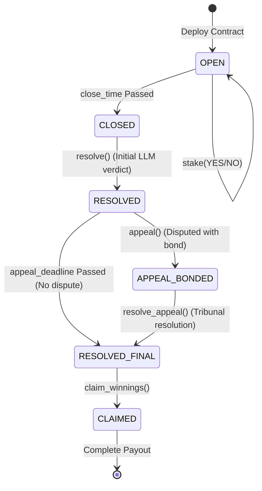

# FactStake: Self-Resolving Prediction Market on GenLayer

> **"FactStake dies without GenLayer — without an on-chain contract that reads the live web and reasons with an LLM, there is no trustless oracle and nothing can settle the market."**

---

## 1. The Problem & Why GenLayer is the Heart

Prediction markets today depend on human-operated oracles (like UMA) to settle outcomes. This is slow (taking days/weeks), expensive (high dispute fees), and vulnerable to bribery or manipulation when large stakes are on the line.

**FactStake removes the human oracle entirely.** 

Users open prediction markets formatted as factual claims about the real world. Other users stake native GEN tokens on YES or NO. When the market close time is reached, the contract itself resolves the outcome by:
1. **Reading live web data** on-chain via `gl.nondet.web.render`.
2. **Reasoning over the data** using an LLM via `gl.nondet.exec_prompt`.
3. **Asserting semantic consensus** across validators on the final verdict (`TRUE` / `FALSE` / `UNRESOLVABLE`).
4. **Distributing payouts** proportionally to the winning side.

If you remove the AI and web-rendering capabilities from the contract, **FactStake cannot exist**. GenLayer is the heart of the product, enabling trustless, automated, self-resolving execution.

---

## 2. Architecture & State Machine

FactStake utilizes a multi-contract ecosystem to achieve modularity and consensus history:

1. **`Market.py`**: Represents a single prediction market. Houses the claim, yes/no pools, staking records, and the nondet resolution/appeal logic.
2. **`MarketFactory.py`**: A deployment registry that programmatically spawns new prediction markets on-chain using `gl.deploy_contract` and tracks active markets.
3. **`Reputation.py`**: Tracks resolver/validator agreement history and indexes markets that resolved to `UNRESOLVABLE` so users can easily find candidates for appeals.

### State Transition Diagram


### Self-Written Appeal Flow
To prevent single-round LLM errors:
- After initial resolution, a 24-hour **appeal window** opens.
- Any user can dispute the verdict by staking an **appeal bond**.
- Staking a bond triggers the `APPEAL_BONDED` state, enabling a second, **stricter tribunal re-evaluation** (`resolve_appeal`).
- If the tribunal overrules the initial verdict, the appealer's bond is returned. If the initial verdict is confirmed, the bond is **added to the winning pool** to reward the players who selected the correct side.

---

## 3. Getting Started & Testing

### Installation
Clone the repository and install the dependencies:
```bash
# Install frontend packages (including genlayer-js)
cd frontend
npm install

# Set up Python testing environment
cd ..
pip install -r requirements.txt
```

### Running Tests
Execute unit and edge-case tests in **Direct Mode** (in-memory simulator):
```bash
pytest tests/ -v
```
This tests:
- Happy paths (open -> stake -> resolve -> payout)
- Dead URLs resolving to `UNRESOLVABLE` and refunding pools
- Single-sided pools refunding without division-by-zero errors
- Double-claim prevention guards
- Staker and disputer appeal-bond mechanisms

---

## 4. Deployment

### Using scripts/deploy.py
To deploy the suite onto your local simulator node or GenLayer testnet, execute:
```bash
# Start your local GenLayer node/simulator
genlayer up

# Run the python deployment script
python scripts/deploy.py
```
This script will automatically:
1. Compile and deploy `Reputation.py`.
2. Retrieve the `Reputation` address.
3. Deploy `MarketFactory.py`, passing the code of `Market.py` and the `Reputation` address to the factory constructor.

---

## 5. Frontend & UI/UX Dashboard

The frontend is a premium, dark-themed dashboard built with **genlayer-js** and Vite.

### Run Locally
```bash
cd frontend
npm run dev
```

### Features
- **Wallet Connection**: Auto-generates/saves localized testnet private keys, display-friendly addresses, and allows private key import.
- **Factory Integration**: Paste your deployed `MarketFactory` contract address to sync all active markets dynamically from the chain.
- **Create Markets**: Fill in claims, duration limits, source URLs, and dispute bonds to deploy a live prediction market on-chain.
- **Interactive Staking**: Stake on YES or NO with loading states.
- **Resolutions & Appeals**: Trigger AI evaluations and dispute outcomes dynamically using standard transaction consensus.
- **Claim Winnings**: Proportional reward calculator and safe payout withdrawal.
